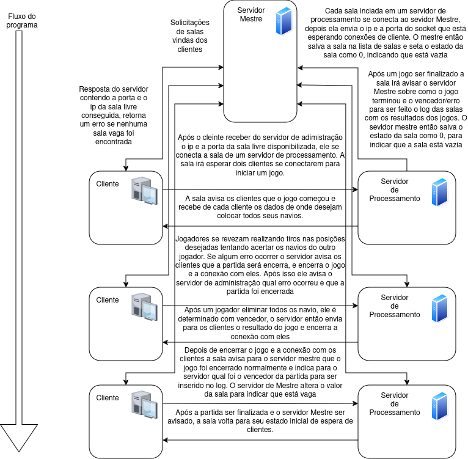

# Projeto de Sistemas Distribuídos - Jogo de Batalha Naval

Este projeto é um sistema distribuído para a hospedagem de salas de jogos, especificamente para o jogo de Batalha Naval. O sistema é composto por três componentes principais: o Servidor de Processamento, o Servidor Mestre (ou Servidor de Administração) e o Cliente. A comunicação entre esses componentes é realizada através de sockets e mensagens estruturadas.

## Autores

- **Marcos Rampaso** - Desenvolvedor 
- **Pedro Costa** - Desenvolvedor

## Professor Orientador

- **Rodrigo Campiolo** - Professor Orientador

## Arquitetura do Projeto

A arquitetura do projeto foi definida com base na "ILustração da arquitetura", disponível neste repositório.




## Componentes do Sistema e Tecnologias

O sistema é composto por diversos componentes desenvolvidos utilizando diferentes tecnologias. As principais tecnologias usadas são:

- **Python**: Utilizado para o desenvolvimento do cliente e do servidor de administração.
- **Linguagem C**: Utilizada para o desenvolvimento do servidor de processamento.
  
### Servidor de Administração (Python)

O servidor de administração gerencia as solicitações dos clientes e coordena a criação e o estado das salas de jogos. Ele se comunica com o servidor de processamento e com os clientes para fornecer informações sobre salas disponíveis e para iniciar e finalizar jogos.

### Servidor de Processamento (C)

O servidor de processamento lida com a criação e a gestão das salas de jogos. Ele aguarda conexões de clientes e gerencia o fluxo do jogo de batalha naval. Quando dois clientes se conectam a uma sala, o servidor de processamento inicia o jogo e gerencia a comunicação entre os jogadores.

### Cliente (Python)

O cliente se conecta ao servidor de administração para solicitar uma sala e iniciar o jogo. Após receber o endereço da sala, o cliente se conecta ao servidor de processamento correspondente e participa do jogo de batalha naval.
## Como Executar a Aplicação

Para executar a aplicação, você precisará ter um compilador de linguagem C instalado em sua máquina, como o GCC, e também o Python. Siga os passos abaixo:

1. **Clone o Repositório**
   - Execute o comando:
     ```bash
     git clone https://github.com/PedroHOCostaa/Servidor_Hospedagem_Jogos/
     ```

2. **Compile o Servidor em C**
   - Vá para o diretório clonado e acesse a pasta `servidor_em_c`:
     ```bash
     cd Servidor_Hospedagem_Jogos/servidor_em_c
     ```
   - Execute o comando `make` para compilar o servidor:
     ```bash
     make
     ```

3. **Execute o Servidor de Administração**
   - Execute o servidor de administração com o comando:
     ```bash
     python servidor_adm.py
     ```

4. **Execute o Servidor em C**
   - Execute o servidor em C com o comando:
     ```bash
     ./servidor_processamento
     ```

5. **Selecione a Porta do Servidor de Processamento**
   - Quando solicitado, selecione uma porta para o servidor de processamento (recomenda-se utilizar a porta 5002).

6. **Inicie o Jogo**
   - Agora, siga as instruções enviadas ao cliente e bom jogo!

## Funcionamento dos componentes e comunicação

### Servidor de Hospedagem de Jogos

O sistema distribuído para hospedagem de salas de jogos é projetado para gerenciar a criação e o gerenciamento de salas de jogos. O fluxo de comunicação é o seguinte:

1. **Cliente**: Solicita ao Servidor Mestre o endereço de uma sala para jogar.
2. **Servidor Mestre**: Envia o endereço da sala para o cliente.
3. **Cliente**: Conecta-se ao endereço fornecido para jogar Batalha Naval (o único jogo implementado para este projeto).

O sistema é composto pelos seguintes processos principais:

### Servidor de Processamento

- **Inicialização**: O servidor de processamento solicita um número de porta inicial `X` pelo terminal.
- **Criação de Salas**: Inicializa `N` threads para salas, cada uma associada a uma porta no intervalo de `X` a `X + N - 1`.
- **Conexão com o Servidor Mestre**: Cada sala se conecta ao servidor mestre e notifica o endereço e a porta que está aguardando conexões.
- **Gerenciamento do Jogo**: Quando dois clientes se conectam a uma sala, o jogo é iniciado. Os clientes trocam mensagens com a sala até que o jogo termine.
- **Finalização**: Após o término do jogo, a sala informa o servidor mestre sobre o resultado e indica que está disponível para novos clientes.

### Cliente

- **Solicitação de Sala**: O cliente se conecta ao servidor mestre e solicita uma sala.
- **Conexão com a Sala**: Após receber o endereço da sala, o cliente se desconecta do servidor mestre e se conecta ao socket da sala para iniciar o jogo.
- **Participação no Jogo**: O cliente escolhe onde posicionar seus navios e onde disparar. Após o término do jogo, o processo é encerrado.

### Servidor Mestre ou Servidor de Administração

- **Conexão com Salas**: O servidor mestre possui um socket que aguarda conexões de salas. Para cada nova conexão, uma thread é criada para lidar com a sala:
  - **Inicialização da Sala**: Inicializa a sala antes do primeiro jogo, salva seu endereço em um objeto sala e o coloca em uma fila de salas.
  - **Atualização do Estado**: Após o término de cada jogo, o estado da sala é atualizado.

- **Conexão com Clientes**: O servidor mestre possui um segundo socket que aguarda conexões de clientes:
  - **Atendimento ao Cliente**: Quando um cliente se conecta, uma thread é criada para atendê-lo. A thread busca uma sala disponível para o cliente usando a lista de salas.
  - **Envio de Endereço da Sala**: Após encontrar uma sala disponível, atualiza o estado da sala e envia seu endereço ao cliente.
  - **Encerramento**: Após o envio do endereço, a thread que lida com o cliente é encerrada e os sockets são fechados.

**Sincronização e Proteção de Dados**:
- As operações de escrita no estado da sala e a busca e atualização do valor na busca da sala para o cliente são protegidas com uma região crítica usando um semáforo. Isso garante a consistência dos dados.

## Cabeçalhos de Comunicação

### Salas -> Servidor Mestre

| Campo  | Tipo       | Descrição                                      |
|--------|------------|------------------------------------------------|
| op     | int (4 bytes) | Tipo de operação: 1 -> Criação de sala, 2 -> Atualização de sala após finalizar jogo |
| port   | int (4 bytes) | Porta que o socket da sala está esperando conexões de clientes. Se `op = 2`, indica o resultado do jogo. |
| error  | int (4 bytes) | Código do erro, se ocorrer algum erro.         |
| size   | int (4 bytes) | Tamanho em UTF-8 do IP.                        |
| ip     | string UTF-8 (size bytes) | IP da sala que está esperando conexões de clientes. |

**Descrição Adicional:**  
Se o servidor de Administração encontrar uma sala com estado `== 1`, essa é a sala selecionada para o jogo. Se não encontrar salas, busca salas com estado `== 0`. Ao selecionar uma sala, ele envia o endereço para o cliente e altera o estado da sala para indicar que mais um jogador se conectou nela. Se nenhuma sala for encontrada ou o tipo de jogo solicitado não estiver disponível, uma mensagem de erro é enviada ao cliente. Se uma sala for encontrada, o endereço é enviado ao cliente. As operações de leitura e escrita no objeto sala e na lista salas são protegidas com uma região crítica usando semáforo.

### Cabeçalho da Comunicação da Sala com o Cliente

| Campo                | Tipo                | Descrição                                                                                                 |
|----------------------|---------------------|-----------------------------------------------------------------------------------------------------------|
| op                   | int (4 bytes)       | Tipo de operação solicitada pela sala: <br> - 1 -> Solicitação de posicionamento de navio <br> - 2 -> Solicitação de disparo <br> - 3 -> Indica que o jogo acabou <br> - 4 -> Solicitação para escolha do tipo de jogo (quantidade de cada navio) |
| mensagem             | int (4 bytes)       | Dependendo de `op`: <br> - Quando `op = 1`: Tipo do navio a ser inserido <br> - Quando `op = 2`: Determina se foi uma vitória, derrota ou erro <br> - Quando `op = 4`: Indica qual jogo foi selecionado |
| mapa jogador         | int array (100x4 bytes) | Mapa do jogador, utilizado quando `op = 1`, `op = 2`, ou `op = 3`                                        |
| mapa adversario      | int array (100x4 bytes) | Mapa do adversário, utilizado quando `op = 2` ou `op = 3`                                                |

**Observação:**  
Após o jogador receber uma solicitação com `op` diferente de 3 (jogo finalizado), o jogador deve salvar os dados solicitados no cabeçalho e seu nome em UTF-8.

### Cliente -> Sala

| Campo         | Tipo                | Descrição                                                                                                 |
|---------------|---------------------|-----------------------------------------------------------------------------------------------------------|
| op            | int (4 bytes)       | Igual ao `op` da solicitação enviada para o cliente.                                                     |
| coluna        | int (4 bytes)       | Valor no eixo y onde o tiro ou o navio será posicionado.                                                 |
| linha         | int (4 bytes)       | Valor no eixo x onde o tiro ou o navio será posicionado.                                                 |
| orientação    | int (4 bytes)       | Utilizada quando `op = 1` (orientação do navio) ou `op = 3` (tipo de jogo)                              |
| size          | int (4 bytes)       | Tamanho do nome em UTF-8.                                                                               |
| nome          | string (size bytes) | Nome do cliente em UTF-8.                                                                               |

**Descrição Adicional:**  
Esta troca de mensagem se repete até que o jogo acabe. A sala manda uma solicitação para o cliente, e o cliente responde com suas escolhas.

## Comunicação Entre o Cliente e o Servidor de Administração

### Cabeçalho de Comunicação Entre o Cliente e o Servidor de Administração

| Campo                | Tipo                | Descrição                                                                                  |
|----------------------|---------------------|--------------------------------------------------------------------------------------------|
| op                   | int (4 bytes)       | Tipo de operação: <br> - 1 -> Solicitação de sala                                         |
| jogo selecionado     | int (4 bytes)       | Número do jogo selecionado (atualmente, somente o jogo 1, Batalha Naval, está implementado) |
| size                 | int (4 bytes)       | Tamanho do nome do cliente em UTF-8                                                         |
| nome                 | string (UTF-8 size) | Nome do cliente em UTF-8                                                                    |

**Observação:**  
Quando o cliente inicia, ele recebe o jogo alvo e o nome do cliente, e então envia uma solicitação para o servidor de administração solicitando uma sala para iniciar o jogo.

## Cabeçalho de Comunicação Entre o Servidor e o Cliente

| Campo                | Tipo                | Descrição                                                                                              |
|----------------------|---------------------|--------------------------------------------------------------------------------------------------------|
| op                   | int (4 bytes)       | Tipo de operação: <br> - 0 -> Se algum erro ocorreu <br> - 1 -> Sala encontrada                      |
| port                 | int (4 bytes)       | Porta da sala, se `op = 1`. Indica a porta onde a sala está aguardando conexões de clientes.           |
| error                | int (4 bytes)       | Código do erro, se `op = 0`. Se não houve erro, esse campo não é utilizado.                            |
| size                 | int (4 bytes)       | Tamanho do IP em bytes, usado para o endereço da sala se `op = 1`.                                      |
| ip                   | string (size bytes) | Endereço IP da sala, se `op = 1`. Se `op = 0`, o IP contém a mensagem de erro recebida.                |

**Observação:**  
O Servidor de Administração busca uma sala com estado `== 1` (livre para novos jogadores). Se não encontrar, procura por salas com estado `== 0` (em espera). Após selecionar uma sala, envia o endereço ao cliente e altera o estado da sala. Se não encontrar uma sala adequada ou se o tipo de jogo solicitado não estiver disponível, envia uma mensagem de erro para o cliente. As operações de leitura e escrita no objeto sala e na lista de salas são protegidas com uma região crítica usando semáforo.

# Funcionamento do Jogo

## Abertura da Sala

1. O Servidor Mestre já está ligado e espera conexões de salas.
2. O Servidor de Processamento inicia e cria as salas.
3. As salas se conectam ao Servidor Mestre, criam um socket para esperar conexões de clientes e indicam o endereço desse socket para o Servidor Mestre.
4. O Servidor de Administração recebe o endereço de cada sala e os salva em objetos sala na lista de salas. Ambos os processos são protegidos por semáforo.

## Início do Cliente

1. O cliente inicia e faz um pedido de sala para o Servidor de Administração.
2. O Servidor de Administração envia ao cliente a sala disponível para se conectar e atualiza o valor do objeto sala.
3. O cliente utiliza o endereço adquirido para se conectar à sala e iniciar o jogo.
4. Após dois jogadores se conectarem a uma sala, o jogo será iniciado.

## Início do Jogo

1. A sala envia uma solicitação de seleção de tipo de jogo para o Jogador 1.
2. O Jogador 1 decide qual tipo de jogo (isto interfere na quantidade de cada navio).
3. A sala envia uma solicitação de posicionamento de navio para o Jogador 1.  
   **Repetir até que todos os navios do Jogador 1 estejam posicionados.**
4. O Jogador 1 insere o navio.
5. A sala envia uma solicitação de posicionamento de navio para o Jogador 2.  
   **Repetir até que todos os navios do Jogador 2 estejam posicionados.**
6. O Jogador 2 insere o navio.

## Meio do Jogo

1. A sala envia uma solicitação de disparo para o Jogador 1.
2. O Jogador 1 realiza o disparo.
3. A sala verifica se o Jogador 2 foi derrotado. Se sim, então finaliza o jogo.
4. A sala envia uma solicitação de disparo para o Jogador 2.
5. O Jogador 2 realiza o disparo.
6. A sala verifica se o Jogador 1 foi derrotado. Se sim, então finaliza o jogo.

   Este fluxo se repete até que o jogo acabe por vitória ou por motivos de erro.

## Finalização do Jogo

1. A sala envia para cada jogador o resultado do jogo.
2. A sala encerra o jogo.
3. Os clientes encerram a conexão com a sala.
4. A sala avisa ao Servidor de Administração que o jogo foi finalizado e que a sala está livre.

